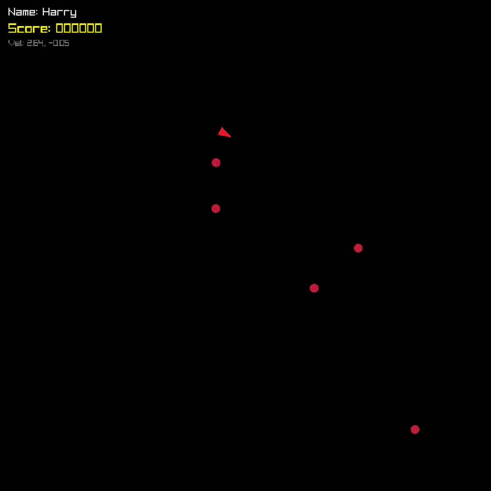

# Asteroids Survival



I developed Asteroids Survival as a miniature browser game, built in C using Raylib, and compiled to WebAssembly via Emscripten, allowing the project to run in the browser with no plugins. In the game the player controls a ship using momentum-based movement, avoiding incoming enemies which home onto their location. To kill the enemies, the player must dodge them and get them to crash into each other.

---

## Gameplay & Features

* **Controls & Handling:** The player controls thrust and rotation using the W, A, and D keys to build up acceleration and velocity. The ship drifts with momentum rather than stopping instantly, requiring careful planning around screen boundaries.
* **Enemy AI:** Enemies spawn periodically along the edges of the screen with slightly randomized speed and acceleration values, then path-find directly toward the player. If an enemy touches the ship, the player dies instantly.
* **Scoring Breakdown:**
* **Enemy Collision (+200 pts):** When two enemies crash into each other, both are destroyed and the player earns 200 points.
* **Near Miss (+50 pts):** Skimming close to an enemy without making contact awards a 50-point graze bonus.


* **Visual Feedback:** Score pop-ups appear briefly at the exact point of impact or near-miss. Enemy collisions trigger particle bursts and camera shake to give hits weight without needing heavy sprite assets.
* **Game Flow:** Starts with a name-entry prompt for the player's name. On death, the run ends immediately, shaking the screen, submitting the run to the online database, and pulling the latest top 10 leaderboard entries onto the screen.

---

## Technical Stack & Architecture

* **Language & Engine:** C (C99 standard) using [raylib](https://www.raylib.com/) configured with `PLATFORM_WEB` and OpenGL ES 2.0.
* **Target:** WebAssembly built with the Emscripten SDK.
* **Rendering:** Purely vector geometry. Everything from the player triangle to enemies, particle bursts, and boundary lines is drawn using Raylib's primitive shape calls, completely skipping external image textures.
* **Web Request Architecture:**
* **Backend Service:** A serverless Cloudflare Worker paired with Cloudflare KV storage, maintaining a global leaderboard capped at the top 10 runs.
* **C-to-Browser Bridge:** To handle HTTP requests without freezing Raylib's frame loop, I used Emscripten's JavaScript interop layer (`emscripten_run_script`, `_malloc`, `stringToUTF8`, and `EMSCRIPTEN_KEEPALIVE`). C triggers an asynchronous browser `fetch()` call in JavaScript, and once the JSON response resolves, JavaScript passes the leaderboard strings back into C memory to populate the UI.


---

## Compiling with Emscripten

### 1. Build the Raylib Web Library (One-Time Setup)

Navigate to the Raylib source directory (`raylib/src`) and compile the static library for WebAssembly:

```cmd
emcc -c rcore.c rshapes.c rtextures.c rtext.c rmodels.c raudio.c -Os -Wall -DPLATFORM_WEB -DGRAPHICS_API_OPENGL_ES2
emar rcs libraylib.a rcore.o rshapes.o rtextures.o rtext.o rmodels.o raudio.o

```

### 2. Compile the Game

Open your terminal, activate the Emscripten environment, and build the project:

```cmd
:: 1. Activate Emscripten environment
C:\path\to\emsdk\emsdk_env.bat

:: 2. Move to the directory containing libraylib.a and minshell.html
cd D:\RayLib\raylib\src

:: 3. Compile source code to WebAssembly
emcc -o index.html "C:\path\to\your\project\main.c" ^
    -Os -Wall ^
    -DPLATFORM_WEB ^
    -I. libraylib.a ^
    -s USE_GLFW=3 ^
    -s ASYNCIFY ^
    -s TOTAL_MEMORY=67108864 ^
    -s ALLOW_MEMORY_GROWTH=1 ^
    -s "EXPORTED_FUNCTIONS=['_main','_ClearLeaderboard','_AddLeaderboardEntry','_malloc','_free']" ^
    -s "EXPORTED_RUNTIME_METHODS=['ccall','cwrap','stringToUTF8','lengthBytesUTF8']" ^
    --shell-file minshell.html

```

#### Build Output:

* `index.html`: The web shell hosting the canvas element.
* `index.js`: The bridge handling runtime initialization and web fetch interop.
* `index.wasm`: The compiled C game binary.

---

## Local Development: Serving & Playing in a Browser

Web browsers block WebAssembly files from loading directly over `file://` URIs due to CORS security rules, so you need a local web server to run the build.

From the folder containing your compiled build files (`index.html`, `index.js`, and `index.wasm`), run:

```bash
python3 -m http.server 8000

```

### How to Test:

1. Open your browser and go to `http://localhost:8000/index.html`.
2. Press **Ctrl + F5** after compiling new changes to force a hard refresh so the browser does not load a cached `.wasm` binary.
3. Press **F12** to open the developer console to monitor asset loading and inspect network responses (`Score saved:`).
4. Shut down the server anytime in your terminal with **Ctrl + C**.

---

## Web Request Source & Leaderboard API

The game talks to a dedicated serverless Cloudflare Worker to persist and fetch global high scores.

* **API Base URL:** `[https://asteroids-leaderboard.2402521.workers.dev](https://asteroids-leaderboard.2402521.workers.dev)`
* **Backend Platform:** Cloudflare Workers with Cloudflare KV storage.
* **Transport Mechanism:** Asynchronous browser `fetch()` calls executed via Emscripten's JavaScript interop layer.

### Endpoints

#### 1. Submit Player Score (`POST /`)

Called automatically when the player dies. The worker saves the name and score, sorts all records in descending order, trims the list down to the top 10, and returns the updated leaderboard.

* **Request Headers:** `Content-Type: application/json`
* **Request Payload:**

```json
{
  "player": "AcePilot",
  "score": 1450
}

```

* **Success Response (`200 OK`):**

```json
{
  "success": true,
  "scores": [
    {
      "player": "AcePilot",
      "score": 1450,
      "date": 1713800000000
    }
  ]
}

```

#### 2. Fetch Leaderboard (`GET /`)

Called when the game first boots up and after every death to refresh the top scores displayed on screen.

* **Success Response (`200 OK`):**

```json
[
  {
    "player": "AcePilot",
    "score": 1450,
    "date": 1713800000000
  }
]

```

---

### AI Declaration
AI model Gemini 3.8 flash was used for modifying the source code and the readme document.